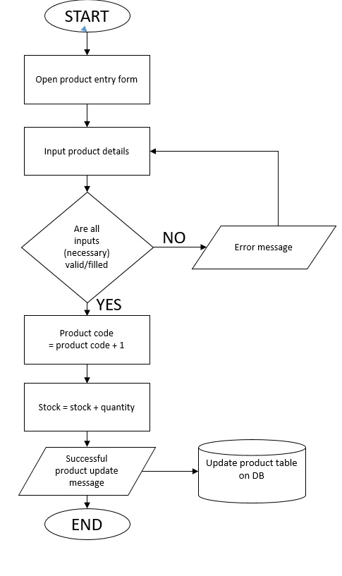
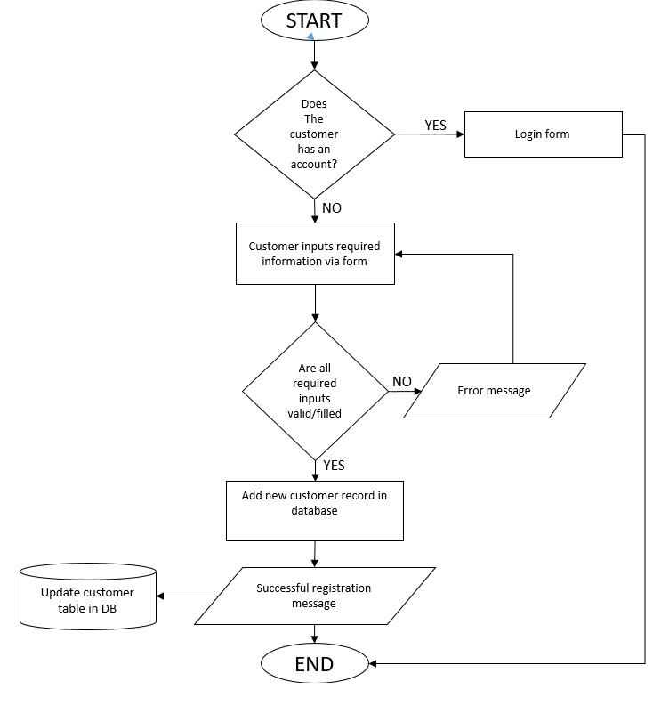
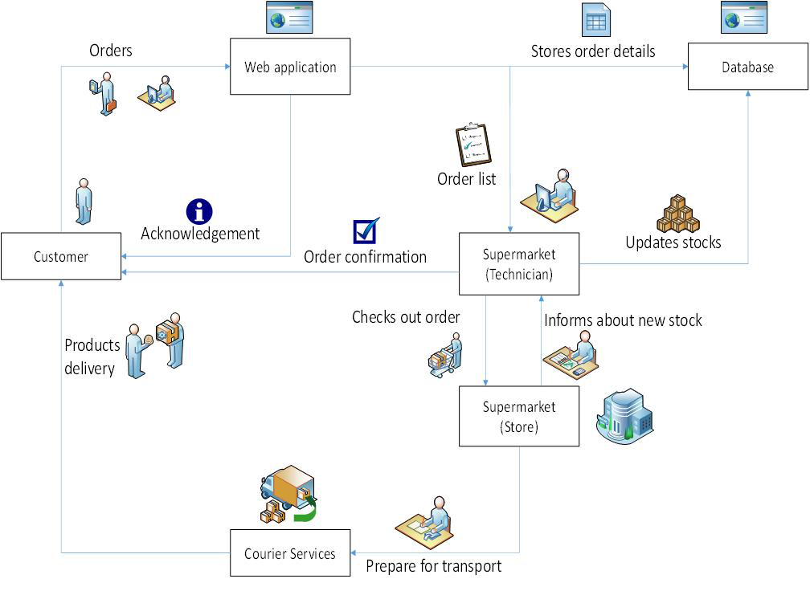
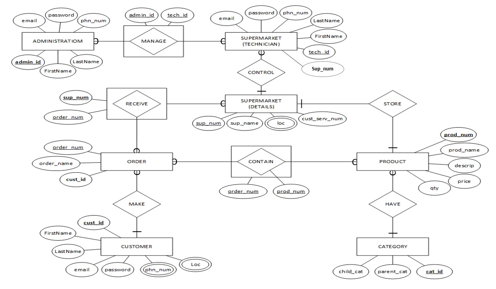

## DESIGN

This is the modeling section that hold the system functionalities in a diagrammatic form.

### FLOW CHART FOR ADMINISTRATION TO ADD A NEW PRODUCT

_Figure ii Flow chart for administration to add a new product_

### BUSINESS SYSTEM FLOW/ FLOW CHART FOR CUSTOMER REGISTRATION

_Figure iii Flow chart for customer registration_

## Data flow

This shows how data starts to flows (circulated) from supermarket to users and vice versa.

### GROCERIES WEB APPLICATION DATA FLOW

_Figure iv Groceries web application data flow_

So a client makes an order via the groceries web application, then the order is sent to the supermarket technician and store in the database.

The supermarket technician sends a confirmation that the order is well received then instructs the store manager to check out the list of orders received. Also he/she can update stock of their supermarket.

Once the order is packed then it is prepare for transport.

## Entity relational diagram

This show the entities of groceries web application alongside their attributes and the relationship among each other.

### ENTITY RELATIONAL DIAGRAM GROCERIES WEB APPLICATION

_Figure v Entity relational diagram groceries web application_

This is most effectively used to represent the tables that are going to be used in groceries web application.
